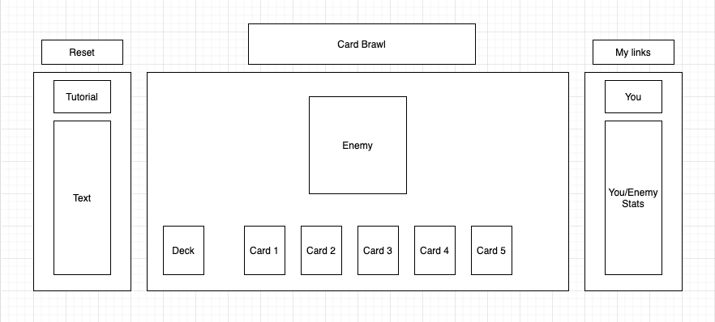

# Background: 
Card Brawl is a dungeon inspired card game featuring the protagonist (you), fighting against a multitude of monsters as you traverse the levels. You as the player will have access to a deck (10 cards), your current hand (5 cards), hitpoints, and mana. You will have to use your dealt hand to either attack (deal damage to monsters) or defend (shield your life from attacks). The rules are simple:

1) Use any combination of cards in your hand to defeat the enemy.
2) You may only use up to what your mana will allow. Each card will have a mana cost so think wisely before rushing into battle.

# Functionality & MVPs: 
In Card Brawl, users will be able to:
1) Start the game by hitting the play button.
2) Reset the game by hitting the reset button.
3) Attack the enemies by playing an attack card.
4) Defend against enemies by playing a shield card.

In additon, this project will include: 
1) A fully guided tutorial by hitting the tutorial button.
2) a production README

# Wireframe #

# Technologies and APIs 
1) Vanilla Javascript to handle the game logic and manipulate the frontend.
2) HTML5 to create a static page.
   - The Canvas API to render the game board.
3) CSS for specific styling.
4) Weback to bundle and transpile the source JavaScript code.

# Implementation Timeline

Friday Afternoon & Weekend:
- Create the overall structure. Set up the canvas and layout and start researching the logic required to interact with the canvas i.e. clicking cards.

Monday:
- Handle the class structure. Fully flesh out the game, card, deck classes.

Tuesday:
- Handle the monster and attacking logic. Flesh out the player and monster classes.

Wednesday:
- Integrate the canvas with the game logic. Clicks should enable class responses and update the board.

Thursday Morning:
- Tweaks and fixes.

