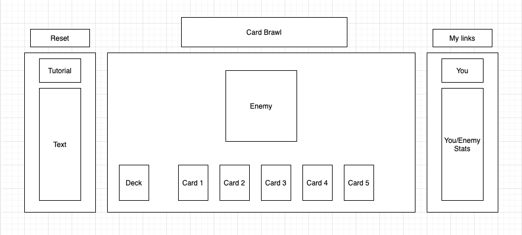

# Background: 
Card Brawl is a dungeon inspired card game featuring the protagonist (you), fighting against Alvin, the main antagonist. You as the player will have access to a deck (10 cards), your current hand (5 cards), hitpoints, and mana. You will have to use your dealt hand to either attack (deal damage to monsters) or defend (shield your life from attacks). The rules are simple:

1) Use any combination of cards in your hand to defeat the enemy.
2) You may only use up to what your mana will allow. Each card will have a mana cost so think wisely before rushing into battle.

# Technologies:
Card Brawl was built using vanilla JavaScript and Canvas. Clicking logic was accomplished through pixel math, delegating each card to a specific coordinate square on the canvas element. Animations were done using a mixture of `requestAnimationFrame` and `setInterval` to cycle through coordinates on a png animation image. Tutorials and sidebar game logic was accomplished through dom-manipulation which was tied to specific game logic.

# Functionality
## Guided User Tutorial
Card Brawl, while not an overly complicated game, can be intimidating on first sight due to a multitude of different cards, and game mechanics. Due to this, I wanted to create a guided user tutorial that explains every aspect of the UI. Due to the game having a large number of elements on the screen at once, `filter: blur` was used to direct the user to the section of the screen they should be staring at.

```Javascript
const Tutorial = {
    first: () => {
        const tutorial1 = document.getElementById("tutorial-1");
        tutorial1.style.display = "";
        htmlUtil.tutorial1BlurOn();
    },

    second: () => {
        const tutorial1 = document.getElementById("tutorial-1");
        tutorial1.style.display = "none";
        htmlUtil.tutorial1BlurOff();
        const tutorial2 = document.getElementById("tutorial-2");
        tutorial2.style.display = "";
        htmlUtil.tutorial2BlurOn();
    }
    ...
}
```


## Game Logic
Card Brawls game logic followed Object Oriented Principals. Classes were created for the Board, Card, Deck, Game, Monsters, and Players. Classes were created with scalability in mind, making it possible to add new bosses, decks, and cards if expansion is desired. 

Some of the notable showcases of game logic would be in both the taking and receiving damage sections. To calculate damage:
1) Shield calculations need to be applied to lessen incoming damage.
2) The bosses current played card needs to be evaluated and subtracted from your current health pool.
3) Users heart count and shield count need to be updated to reflect the damage received, which was accomplished using `filter: greyscale(1)`.
4) Internal logic needed to be applied to note whether you or the boss had lost all of its health.
5) If calculations were being done for the boss, healing effects needed to be applied.

```Javascript
updateShields() {
   for (let i = 4; this.shield < i; i--) {
      document.getElementById(`shield-${i}`).style.filter = "grayscale(1)"
   }
   for (let j = 1; j < this.shield + 1; j++) {
      document.getElementById(`shield-${j}`).style.removeProperty('filter')
   }
}

takeDamage(damage) {
   let combinedHealth = this.shield + this.hp;
   combinedHealth -= damage;
   if (this.hp >= combinedHealth) {
      this.hp = combinedHealth;
      this.shield = 0;
   } else {
      this.shield -= num;
   }
   if (!this.isAlive()) {
      const gameLostOverlay = document.getElementById("game-lost-overlay")
      htmlUtil.overlayBlurOn();
      gameLostOverlay.style.display = ""
   }

   this.greyHealth();
}
```


<!-- # Functionality & MVPs: 
In Card Brawl, users will be able to:
1) Start the game by hitting the play button.
2) Reset the game by hitting the reset button.
3) Attack the enemies by playing an attack card.
4) Defend against enemies by playing a shield card.

In additon, this project will include: 
1) A fully guided tutorial by hitting the tutorial button.
2) a production README

# Wireframe #


# Technologies and APIs 
1) Vanilla Javascript to handle the game logic and manipulate the frontend.
2) HTML5 to create a static page.
   - The Canvas API to render the game board.
3) CSS for specific styling.
4) Weback to bundle and transpile the source JavaScript code.

# Implementation Timeline

Friday Afternoon & Weekend:
- Create the overall structure. Set up the canvas and layout and start researching the logic required to interact with the canvas i.e. clicking cards.

Monday:
- Handle the class structure. Fully flesh out the game, card, deck classes.

Tuesday:
- Handle the monster and attacking logic. Flesh out the player and monster classes.

Wednesday:
- Integrate the canvas with the game logic. Clicks should enable class responses and update the board.

Thursday Morning:
- Tweaks and fixes. -->


